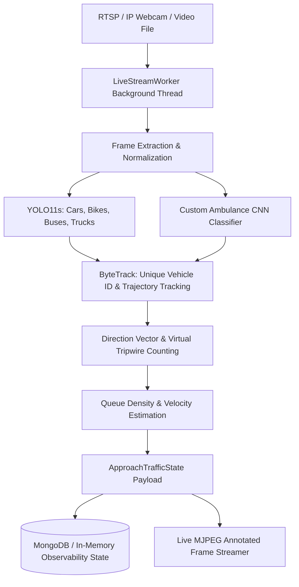
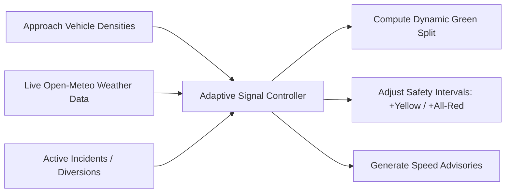
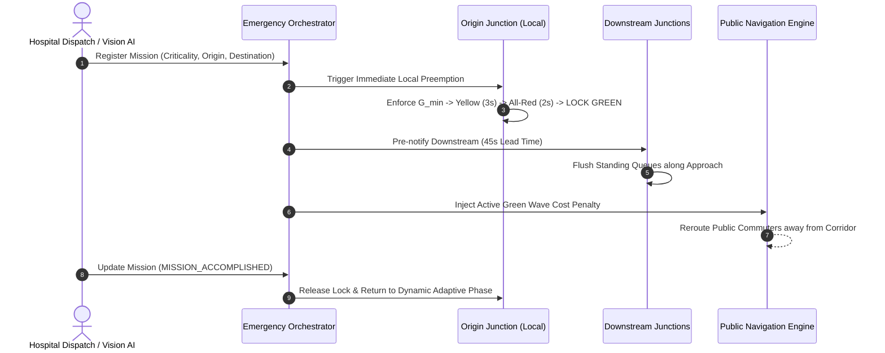

# 🚦 Automated Traffic Control & Intelligent Road Safety System

[](https://fastapi.tiangolo.com/)
[](https://react.dev/)
[](https://github.com/ultralytics/ultralytics)
[](https://opencv.org/)
[](https://leafletjs.com/)
[](https://www.mongodb.com/)
[](https://open-meteo.com/)
[](LICENSE)

A production-grade, full-stack **Intelligent Traffic Control and Road Safety Automation Platform**. Powered by **Dual-Model Real-Time Vision AI** (YOLO11 / YOLOv8 + Custom Deep Neural Ambulance Classifier), **Continuous Multi-Stream CCTV / RTSP / IP Webcam Ingestion**, **Interactive Real-World Geospatial Mapping (Leaflet / OpenStreetMap)** across major metropolitan grids, **Dynamic Shortest Path Citizen Navigation**, **Open-Meteo Weather-Adaptive Signal Timing**, **Automated Upstream Incident Diversion**, and **Multi-Junction Green Wave Emergency Preemption**.

> **Real-World Mission Scenario:**  
> When an emergency ambulance is dispatched or visually detected on the *North Approach* of *Connaught Place Junction*, the system instantly locks local signals to green, calculates the fastest transit corridor, pre-notifies downstream junctions (*e.g., ITO Intersect*) 45 seconds ahead to flush standing queues, and updates citizen navigation maps in real-time with zero manual dispatcher intervention.

---

## 📑 Table of Contents

- [Key Features](#-key-features)
- [System Architecture](#-system-architecture)
- [How It Works](#-how-it-works)
  - [1. Dual-Model AI Vision & Live Stream Ingestion](#1-dual-model-ai-vision--live-stream-ingestion)
  - [2. Weather-Aware Adaptive Signal Optimization](#2-weather-aware-adaptive-signal-optimization)
  - [3. Multi-Junction Green Wave Emergency Preemption](#3-multi-junction-green-wave-emergency-preemption)
  - [4. Dynamic Shortest Path Navigation & Upstream Incident Diversion](#4-dynamic-shortest-path-navigation--upstream-incident-diversion)
- [Role-Based Portals & Access Control](#-role-based-portals--access-control)
- [Metropolitan City Grids](#-metropolitan-city-grids)
- [Tech Stack](#-tech-stack)
- [Project Directory Structure](#-project-directory-structure)
- [Getting Started](#-getting-started)
  - [Prerequisites](#prerequisites)
  - [Backend Setup](#backend-setup)
  - [Frontend Setup](#frontend-setup)
  - [Live Camera / RTSP & IP Webcam Ingestion Setup](#live-camera--rtsp--ip-webcam-ingestion-setup)
- [Environment Configuration](#-environment-configuration)
- [API Reference](#-api-reference)
  - [Junction Management & Simulation](#1-junction-management--simulation)
  - [Video Ingestion & Live AI Feeds](#2-video-ingestion--live-ai-feeds)
  - [Hospital Emergency Ambulance Dispatch](#3-hospital-emergency-ambulance-dispatch)
  - [Public Citizen Navigation](#4-public-citizen-navigation)
  - [Incidents & Upstream Diversions](#5-incidents--upstream-diversions)
  - [Live Weather Telemetry](#6-live-weather-telemetry)
  - [Traffic Analytics](#7-traffic-analytics)
  - [Authentication & Role Profiles](#8-authentication--role-profiles)
- [Database & Storage Architecture](#-database--storage-architecture)
- [Testing & Quality Assurance](#-testing--quality-assurance)
- [Roadmap](#-roadmap)
- [Author & License](#-author--license)

---

## 🌟 Key Features

- **Dual-Model Real-Time Vision AI:**
  - **Standard Multi-Class Vehicle Detector:** Powered by **YOLO11s / YOLOv8** for tracking `car`, `motorcycle`, `bus`, and `truck`.
  - **Specialized Emergency Vehicle Neural Network:** Dedicated custom-trained ambulance classifier with temporal confirmation heuristics to eliminate false alarms.
- **Continuous CCTV / RTSP / IP Webcam Ingestion:**
  - Thread-isolated `LiveStreamWorker` processes live IP streams, Android IP Webcam feeds, RTSP CCTV cameras, and local webcams at configurable sampling rates.
  - Generates live annotated MJPEG video streams (`/api/videos/live/{junction_id}/{approach}/annotated-stream`) with bounding boxes, tracking IDs, vehicle speeds, and congestion overlays.
- **4-Way Multi-Approach Virtual Tripwires:**
  - Individual calibration for **NORTH**, **SOUTH**, **EAST**, and **WEST** camera feeds.
  - Directional vector analysis, tripwire crossing counters, queue length estimation, and stationary/parked vehicle classification.
- **Weather-Adaptive Signal Control:**
  - Pulls live satellite meteorological telemetry via **Open-Meteo API** (precipitation, fog visibility, humidity, wind, and road surface friction).
  - Automatically extends yellow clearance ($+1.5\text{s}$) and all-red safety buffer ($+2.0\text{s}$) during inclement weather to prevent skidding in vehicle dilemma zones.
- **Multi-Junction Cascading Green Wave:**
  - Interconnected signal preemption that flushes standing queues 45 seconds ahead of approaching ambulances across consecutive urban junctions.
  - Multi-tier priority resolution (`CRITICAL_LIFE_THREATENING` > `HIGH` > `MEDIUM` > `LOW`) handling simultaneous multi-emergency corridor conflicts.
- **Dynamic Shortest Path Citizen Navigation:**
  - GPS Dijkstra routing engine weighted by physical distance, live Vision AI vehicle density, weather surface traction, active road closures, and active green wave corridors.
  - Turn-by-turn routing with live ETA predictions and bottleneck avoidance.
- **Automated Upstream Incident Diversion:**
  - On-scene accident reporting dynamically throttles upstream junction inflow and compensates arterial phase timing to prevent secondary gridlock.
- **Interactive Geospatial Street Map:**
  - Leaflet + OpenStreetMap engine rendering actual GPS coordinates with live color-coded congestion markers, ambulance tracking halos, and incident alerts across **Delhi NCR**, **Mumbai**, **Hyderabad**, and **Bengaluru**.
- **Role-Based Portals:**
  - Unified gateway tailored for **Public Citizens**, **Hospital Emergency Dispatch**, and **Traffic Police / Government Operations**.

---

## 🏗️ System Architecture

```text
                               ┌────────────────────────────────────────────────────────┐
                               │           React 18 + Vite + Leaflet HUD                │
                               │  (Public Citizen • Hospital Dispatch • Police Command) │
                               └───────────────────────────┬────────────────────────────┘
                                                           │ REST API / Live MJPEG Stream
                                                           ▼
                               ┌────────────────────────────────────────────────────────┐
                               │                  FastAPI Core Engine                   │
                               │  (Pydantic V2 Models • Role Auth • Event Orchestration) │
                               └───────┬───────────────────────────────┬────────────────┘
                                       │                               │
            ┌──────────────────────────┴─────────────┐                 │
            │      Real-Time Vision AI Pipeline      │                 │
            │                                        │                 │
    ┌───────┴──────────────┬─────────────────────────┴─────────┐       │
    │                      │                                   │       │
    ▼                      ▼                                   ▼       ▼
┌──────────────────┐ ┌──────────────────────────┐ ┌──────────────────────────┐
│ YOLO11s / YOLOv8 │ │ Custom Ambulance CNN     │ │ ByteTrack Directional    │
│ Multi-Class      │ │ High-Recall Weights      │ │ Trajectory & Tripwires   │
└─────────┬────────┘ └─────────────┬────────────┘ └────────────┬─────────────┘
          │                        │                           │
          └────────────────────────┼───────────────────────────┘
                                   │ Real-Time Traffic Observation State
                                   ▼
┌───────────────────────────────────────────────────────────────────────────────────────┐
│                           Intelligent Decision Engine                                 │
│  ┌───────────────────────┐ ┌─────────────────────────┐ ┌───────────────────────────┐  │
│  │ Adaptive Signal Logic │ │ Multi-Junction Green   │ │ Dynamic Navigation Engine │  │
│  │ (Webster + Friction)  │ │ Wave Orchestrator      │ │ (Dijkstra + Incidents)    │  │
│  └───────────────────────┘ └─────────────────────────┘ └───────────────────────────┘  │
└──────────────────┬───────────────────────────────────────────────────┬────────────────┘
                   │                                                   │
                   ▼                                                   ▼
┌──────────────────────────────────────┐             ┌──────────────────────────────────┐
│     Live Environmental Telemetry     │             │     Database & Storage Layer     │
│   (Open-Meteo Weather Services)      │             │  (MongoDB / Resilient In-Memory) │
└──────────────────────────────────────┘             └──────────────────────────────────┘
```

---

## 🔄 How It Works

### 1. Dual-Model AI Vision & Live Stream Ingestion



1. **Stream Capture:** Ingests live video over RTSP, HTTP MJPEG, or uploaded `.mp4`/`.avi` files per junction approach.
2. **Dual Inference:** Each frame runs through YOLO11s (COCO vehicle classes) in parallel with a specialized Ambulance detection model.
3. **Temporal Verification:** Detections are filtered through a multi-frame temporal hysteresis window to prevent brief occlusion misclassifications.
4. **Trajectory & Tripwire:** ByteTrack tracks object center points across user-calibrated virtual tripwire lines to compute precise inflow/outflow counts.
5. **State Generation:** Real-time density, queue length, speed, and emergency presence are packaged into structured `ApproachTrafficState` observations.

---

### 2. Weather-Aware Adaptive Signal Optimization

The adaptive signal controller balances cycle times and green phase distribution using real-time approach demand weighted against environmental road traction:



- **Green Split Allocation:** Based on the ratio of critical lane volume between opposing approaches ($V_{NS}$ vs. $V_{EW}$):
  $$\text{Green}_{NS} = \frac{V_{NS}}{V_{NS} + V_{EW}} \times (\text{Cycle} - \text{Lost Time})$$
- **Friction-Compensated Intervals:** When rainfall, snow, or fog reduces road friction below nominal thresholds ($\mu < 0.70$), yellow duration is extended by $+1.5\text{s}$ and all-red clearance interval by $+2.0\text{s}$ to mitigate braking dilemma zones.

---

### 3. Multi-Junction Green Wave Emergency Preemption



---

### 4. Dynamic Shortest Path Navigation & Upstream Incident Diversion

- **Dynamic Edge Weights:** Evaluates real-time edge travel cost:
  $$\text{Cost}_{e} = \text{Distance}_e \times (1.0 + \alpha \cdot \text{CongestionMultiplier}) \times \left(\frac{1.0}{\text{FrictionFactor}}\right) + \text{IncidentPenalty}_e$$
- **Incident Mitigation:** When an accident is confirmed, upstream approach signals reduce incoming green duration by $40\%$, dynamically shifting traffic load to parallel diversion bypasses.

---

## 👥 Role-Based Portals & Access Control

| Role Persona | Target Users | Allowed Actions & Capabilities | Default Credentials |
|---|---|---|---|
| **🏛️ Traffic Police & Government Command** | City Traffic Police, Municipal Transport Authorities | Full CCTV/RTSP multi-camera view, live manual signal overrides, incident verification & resolution, system calibration, corridor simulation. | `traffic_command` / `police123`<br>`gov_admin` / `govsecure2026` |
| **🚑 Hospital Emergency Dispatch** | Trauma Centers, Ambulance Fleets, Dispatchers | Emergency mission registration, priority criticality setting (`CRITICAL`, `HIGH`, `MEDIUM`), real-time corridor tracking, Green Wave status monitoring. | `hospital_admin` / `hospital123`<br>`apollo_dispatch` / `apollo2026` |
| **👥 Public Citizen & Commuter** | Motorists, Pedestrians, Daily Commuters | Dynamic traffic-weighted GPS navigation, live road accident reporting with photo/camera verification, real-time congestion heatmaps, weather safety advisories. | *Open Access (No Password Required)* |

---

## 🗺️ Metropolitan City Grids

The platform includes real-world GPS coordinates and pre-calibrated multi-junction topological networks for four major Indian metropolitan areas:

```text
🏛️ New Delhi / NCR       🌊 Mumbai Metropolitan      💎 Hyderabad Cyber Hub     🌳 Bengaluru Tech Grid
├── Connaught Place (CP)  ├── BKC Financial Core     ├── Hitec City Cyber Towers├── Silk Board Junction
├── ITO Intersect        ├── Dadar TT Circle        ├── Gachibowli ORR         ├── Electronic City
├── Civil Lines Ring     ├── Marine Drive Express   ├── Jubilee Hills Checkpost├── Koramangala 80ft Road
├── AIIMS Trauma Grid    ├── Andheri Western Exp    ├── Begumpet Aerodrome     ├── Indiranagar 100ft Rd
└── Dhaula Kuan Arterial └── Vashi Toll Plaza       └── Charminar Heritage Core└── MG Road Central
```

---

## 💻 Tech Stack

### Frontend
- **Framework:** [React 18](https://react.dev/) + [Vite 5](https://vitejs.dev/)
- **Geospatial Mapping:** [Leaflet 1.9](https://leafletjs.com/) (OpenStreetMap & CartoDB tiles)
- **Icons:** [Lucide React](https://lucide.dev/)
- **Styling:** Custom Modular Modern CSS with Dark-Mode Glassmorphism HUD
- **State & Streaming:** Real-time MJPEG Stream Consumer & Asynchronous Fetch API

### Backend
- **Framework:** [FastAPI](https://fastapi.tiangolo.com/) (Asynchronous ASGI) + [Uvicorn](https://www.uvicorn.org/)
- **Data Validation:** [Pydantic V2](https://docs.pydantic.dev/) + Settings Management
- **Computer Vision & Tracking:** [Ultralytics YOLO11 / YOLOv8](https://github.com/ultralytics/ultralytics), [OpenCV](https://opencv.org/), [ByteTrack](https://github.com/ifzhang/ByteTrack), [LAP](https://github.com/gatagat/lap)
- **Database:** [MongoDB (PyMongo)](https://www.mongodb.com/) with automatic In-Memory Resilient Fallback Engine
- **Meteorological Telemetry:** [Open-Meteo REST API](https://open-meteo.com/) (Live satellite weather & surface friction)
- **Video & Multimedia:** `ffmpeg`, `static-ffmpeg`, `python-multipart`
- **Testing:** [Pytest](https://docs.pytest.org/), `httpx`

---

## 📂 Project Directory Structure

```text
Automated_Traffic_Control/
├── backend/
│   ├── api/
│   │   ├── routes_ambulance.py      # Emergency ambulance registration & Green Wave
│   │   ├── routes_analytics.py      # Traffic metrics, historical trends & density stats
│   │   ├── routes_auth.py           # Role-based access control & portal authentication
│   │   ├── routes_incident.py       # On-scene accident reporting & upstream diversions
│   │   ├── routes_junction.py       # Junction CRUD, city filtering & signal simulation
│   │   ├── routes_navigation.py     # Dynamic Dijkstra shortest path citizen routing
│   │   ├── routes_video.py          # Video upload, batch processing & live MJPEG feeds
│   │   └── routes_weather.py        # Open-Meteo telemetry & road safety friction
│   │
│   ├── core/
│   │   ├── analytics/
│   │   │   ├── junction_aggregator.py # Aggregates 4-approach traffic state
│   │   │   └── traffic_metrics.py     # Flow rates, queue calculation & congestion levels
│   │   ├── control/
│   │   │   ├── adaptive_signal.py     # Dynamic green split & weather timing adjuster
│   │   │   ├── ambulance_engine.py    # Local ambulance priority preemption resolver
│   │   │   ├── diversion_engine.py    # Upstream incident capacity compensation
│   │   │   ├── emergency_orchestrator.py # Multi-junction corridor coordinator
│   │   │   ├── navigation_engine.py   # Traffic-weighted Dijkstra pathfinder
│   │   │   └── signal_simulation.py   # Time-stepped junction & corridor simulation
│   │   ├── vision/
│   │   │   ├── detector.py            # YOLO vehicle and ambulance detector
│   │   │   ├── emergency_bridge.py    # Vision-to-preemption event pipeline
│   │   │   ├── live_stream_manager.py # Thread worker for RTSP & live cameras
│   │   │   ├── tracker.py             # ByteTrack vehicle tracking & tripwires
│   │   │   └── video_processor.py     # Offline video inference & MP4 generator
│   │   └── weather/
│   │       └── weather_service.py     # Live Open-Meteo client & friction calculator
│   │
│   ├── db/
│   │   ├── mongo_client.py            # MongoDB connector with in-memory fallback
│   │   └── repositories/
│   │       ├── ambulance_repo.py      # Emergency missions storage
│   │       ├── incident_repo.py       # Incident records & diversion plans
│   │       ├── junction_repo.py       # Junction topologies & counting line calibration
│   │       └── traffic_repo.py        # Approach observations & analytics logs
│   │
│   ├── models/
│   │   ├── ambulance_schemas.py       # Pydantic schemas for missions & preemption
│   │   ├── auth_schemas.py            # Role personas & authentication payloads
│   │   ├── incident_schemas.py        # Accident reports & diversion models
│   │   ├── navigation_schemas.py      # Routing requests, corridors & step directions
│   │   ├── traffic_schemas.py         # Vehicles, cameras, tripwires & signal states
│   │   └── weather_schemas.py         # Weather telemetry & safety intervals
│   │
│   ├── tests/
│   │   ├── test_aggregator.py         # Unit tests for 4-way approach aggregator
│   │   ├── test_ambulance_auth.py     # Emergency dispatch & mission lifecycle tests
│   │   ├── test_api.py                # API endpoints integration tests
│   │   ├── test_camera_geometry.py    # Tripwire vector & ROI boundary tests
│   │   ├── test_directional_state.py  # Tracking direction & movement state tests
│   │   ├── test_dual_model_vision.py  # YOLO + Ambulance classifier tests
│   │   ├── test_incidents_weather.py  # Accident reporting & weather friction tests
│   │   ├── test_metrics.py            # Flow & queue length calculation tests
│   │   ├── test_navigation.py         # Dijkstra routing & cost multiplier tests
│   │   └── test_signal_simulation.py  # Time-stepped signal simulator tests
│   │
│   ├── config.py                      # Global settings, model paths & thresholds
│   └── main.py                        # FastAPI entry point & CORS configuration
│
├── frontend/
│   ├── src/
│   │   ├── components/
│   │   │   ├── AmbulanceDispatchPortal.jsx # Hospital emergency command center
│   │   │   ├── AnalyticsHistory.jsx        # Traffic trends & flow chart visualizations
│   │   │   ├── ApproachFeedCard.jsx        # Live AI annotated MJPEG stream player
│   │   │   ├── CountingLineEditor.jsx      # Interactive visual tripwire calibrator
│   │   │   ├── GovernmentCommandPortal.jsx # Police operations & manual override HUD
│   │   │   ├── IncidentManager.jsx         # Incident list & diversion supervisor
│   │   │   ├── IncidentReportingModal.jsx  # Citizen incident reporter with camera upload
│   │   │   ├── LiveJunctionMap.jsx         # Real-world Leaflet geospatial city map
│   │   │   ├── PortalLandingPage.jsx       # Gateway portal switcher
│   │   │   ├── PublicCitizenPortal.jsx     # Navigation, detour alerts & weather tips
│   │   │   ├── RoleAuthHeader.jsx          # Role authentication header & banner
│   │   │   ├── SignalSimulator.jsx         # Time-stepped corridor signal simulator
│   │   │   ├── VideoUploader.jsx           # Single/Batch 4-approach video uploader
│   │   │   └── WeatherWidget.jsx           # Meteorological HUD & friction index
│   │   │
│   │   ├── services/
│   │   │   └── api.js                      # Axios/Fetch API client
│   │   ├── App.jsx                         # Main application layout & state
│   │   ├── index.css                       # Modern dark-mode styling & animations
│   │   └── main.jsx                        # React root entrypoint
│   ├── package.json
│   └── vite.config.js
│
├── data/                                  # Local storage for uploads & video outputs
│   ├── uploads/                           # Incoming raw video uploads
│   └── annotated/                         # Bounding-box annotated MP4 outputs
│
├── scripts/                               # Evaluation & diagnostic utility scripts
├── requirements.txt                       # Python backend dependencies
└── README.md
```

---

## 🚀 Getting Started

### Prerequisites

Ensure the following tools are installed on your machine:
- **Python 3.10+** (Recommended: 3.10 or 3.11)
- **Node.js (v18+) & npm**
- **FFmpeg** (Accessible in system PATH or configured in `config.py`)
- **MongoDB** *(Optional — system automatically activates resilient in-memory storage if MongoDB is not running)*

---

### Backend Setup

1. **Clone the repository:**
   ```bash
   git clone https://github.com/PiyushMishra-Me/Automated_Traffic_Control.git
   cd Automated_Traffic_Control
   ```

2. **Create and activate a virtual environment:**
   - **Windows (PowerShell):**
     ```powershell
     python -m venv .venv
     .venv\Scripts\Activate.ps1
     ```
   - **macOS / Linux:**
     ```bash
     python3 -m venv .venv
     source .venv/bin/activate
     ```

3. **Install dependencies:**
   ```bash
   pip install -r requirements.txt
   ```

4. **Verify pre-trained models:**
   The backend loads `yolo11s.pt` automatically on first run. If you have custom trained ambulance weights, ensure they are referenced in `backend/config.py`.

5. **Start the FastAPI server:**
   ```bash
   python -m uvicorn backend.main:app --host 0.0.0.0 --port 8000 --reload
   ```

   - **API Root:** [http://localhost:8000](http://localhost:8000)
   - **Interactive Swagger Docs:** [http://localhost:8000/docs](http://localhost:8000/docs)
   - **ReDoc:** [http://localhost:8000/redoc](http://localhost:8000/redoc)

---

### Frontend Setup

1. **Navigate to the frontend directory:**
   ```bash
   cd frontend
   ```

2. **Install npm dependencies:**
   ```bash
   npm install
   ```

3. **Start the Vite development server:**
   ```bash
   npm run dev
   ```

   - **Web Application:** [http://localhost:5173](http://localhost:5173)

---

### Live Camera / RTSP & IP Webcam Ingestion Setup

You can connect real-time video streams directly to any junction approach:

1. **Android / Smartphone IP Webcam:**
   - Install **IP Webcam** (Android) or **RTSP Camera**.
   - Start the server on your phone (e.g., `http://192.168.1.50:8080/video`).
2. **Register the Stream via API or Frontend:**
   - In the **Government Command Portal**, select the junction approach (e.g., `DELHI-CP-01` -> `NORTH`).
   - Enter your RTSP URL or HTTP MJPEG URL.
   - The backend immediately begins real-time YOLO tracking and streams annotated frames back to the dashboard!

---

## ⚙️ Environment Configuration

You can customize runtime behavior by creating a `.env` file in the project root:

```env
# =========================================================
# Application Configuration
# =========================================================
APP_NAME="Automated Traffic Control & Intelligent Safety System"
DEBUG=true

# =========================================================
# Database Settings
# =========================================================
# MongoDB connection URI (falls back to In-Memory if unreachable)
MONGODB_URI=mongodb://localhost:27017
DATABASE_NAME=traffic_management_db

# =========================================================
# Vision & Deep Learning
# =========================================================
# Model weights for general vehicle detection
MODEL_PATH=yolo11s.pt

# Confidence thresholds
CONFIDENCE_THRESHOLD=0.20
AMBULANCE_CONFIDENCE_THRESHOLD=0.36
IOU_THRESHOLD=0.45
INFERENCE_IMAGE_SIZE=640

# =========================================================
# FFmpeg Binary Path (Optional, leave blank for system PATH)
# =========================================================
FFMPEG_BINARY=
```

---

## 📡 API Reference

### 1. Junction Management & Simulation
- `GET /api/junctions?city={city}` - List all junctions (optionally filtered by city: `DELHI`, `MUMBAI`, `HYDERABAD`, `BENGALURU`).
- `GET /api/junctions/{junction_id}` - Retrieve metadata, approach coordinates, and custom tripwires for a specific junction.
- `GET /api/junctions/{junction_id}/state` - Aggregated real-time 4-way traffic state.
- `GET /api/junctions/{junction_id}/signal-recommendation` - Get optimal green split and phase recommendations.
- `POST /api/junctions/{junction_id}/signal-simulation` - Run deterministic time-stepped simulation with optional manual RED overrides.
- `POST /api/junctions/corridor-simulation` - Multi-junction corridor green wave simulation.
- `PUT /api/junctions/{junction_id}/counting-lines` - Update custom tripwire coordinates for an approach.

### 2. Video Ingestion & Live AI Feeds
- `POST /api/videos/upload` - Upload video for single junction approach (`multipart/form-data`).
- `POST /api/videos/batch-upload` - Concurrently upload all 4 approach videos for simultaneous parallel inference.
- `GET /api/videos/status/{job_id}` - Track progress percentage and completion status of an inference job.
- `POST /api/videos/live-stream` - Register RTSP / IP webcam feed for continuous live inference.
- `GET /api/videos/live-stream/{junction_id}` - Query active camera stream configurations.
- `GET /api/videos/live/{junction_id}/{approach}/annotated-stream` - **Live MJPEG Stream** with bounding boxes, tracking labels, and speed overlays.
- `GET /api/videos/annotated/{filename}` - Download or stream rendered annotated MP4 file.

### 3. Hospital Emergency Ambulance Dispatch
- `POST /api/ambulances/register` - Register emergency ambulance mission with criticality (`LOW`, `MEDIUM`, `HIGH`, `CRITICAL_LIFE_THREATENING`).
- `GET /api/ambulances` - List all active and historical ambulance missions.
- `GET /api/ambulances/{mission_id}` - Get real-time corridor position, route telemetry, and conflict status.
- `PATCH /api/ambulances/{mission_id}/status` - Advance mission progress (`DISPATCHED` -> `ON_SCENE` -> `TRANSIT_TO_HOSPITAL` -> `MISSION_ACCOMPLISHED`).
- `GET /api/ambulances/junction/{junction_id}/preemption` - Query active Green Wave lock status for a junction.

### 4. Public Citizen Navigation
- `POST /api/navigation/route` - Compute dynamic fastest route accounting for live traffic density, incidents, and weather.
  **Request Body:**
  ```json
  {
    "origin_junction_id": "DELHI-CP-01",
    "destination_junction_id": "DELHI-AIIMS-04",
    "transport_mode": "car"
  }
  ```
  **Response:**
  ```json
  {
    "route_junction_ids": ["DELHI-CP-01", "DELHI-ITO-02", "DELHI-AIIMS-04"],
    "total_distance_km": 8.4,
    "estimated_time_minutes": 14.2,
    "congestion_level": "MEDIUM",
    "step_directions": [
      "Head South from Connaught Place toward ITO Intersect",
      "Proceed straight through ITO Intersect via Green Wave bypass",
      "Arrive at AIIMS Trauma Center Junction"
    ]
  }
  ```
- `GET /api/navigation/corridors` - Retrieve live congestion multipliers and cost weights for all road corridors.

### 5. Incidents & Upstream Diversions
- `GET /api/incidents` - List all reported accidents, vehicle breakdowns, and road closures.
- `POST /api/incidents` - Report new incident with severity, blocked lanes, and optional scene evidence photo.
- `PATCH /api/incidents/{incident_id}/status` - Update incident status (`REPORTED` -> `VERIFIED` -> `DIVERSION_ACTIVE` -> `RESOLVED`).
- `GET /api/incidents/junction/{junction_id}/active-diversions` - Retrieve active upstream diversion plans.

### 6. Live Weather Telemetry
- `GET /api/weather/junction/{junction_id}` - Fetch live Open-Meteo satellite weather, rain rate, visibility, and surface friction coefficient.
- `POST /api/weather/junction/{junction_id}/override` - Simulate extreme weather conditions (rain, dense fog, snow) for safety stress testing.
- `DELETE /api/weather/junction/{junction_id}/override` - Clear simulation override and restore live satellite telemetry.

### 7. Traffic Analytics
- `GET /api/analytics/junction/{junction_id}/approach/{approach}` - Get latest observation snapshot.
- `GET /api/analytics/junction/{junction_id}/history` - Historical observation time-series.
- `GET /api/analytics/junction/{junction_id}/summary` - Average vehicle counts, peak volume, flow rates, and density metrics.

### 8. Authentication & Role Profiles
- `GET /api/auth/profiles` - Get permissions and capability metadata for all three user personas.
- `POST /api/auth/login` - Authenticate Police or Hospital Dispatch credentials.

---

## 🗄️ Database & Storage Architecture

The database manages four core operational collections:

| Collection Name | Key Fields & Indexes | Description |
|---|---|---|
| `junctions` | `junction_id` (Unique), `city`, `latitude`, `longitude`, `approaches`, `custom_counting_lines` | Stores metropolitan junction node geometries and calibrated virtual tripwires. |
| `traffic_observations` | `junction_id`, `approach`, `timestamp`, `vehicle_count`, `density`, `queue_length`, `ambulance_detected` | Time-series observations written by Vision AI workers every second. |
| `ambulance_missions` | `mission_id`, `criticality`, `origin_junction_id`, `destination_junction_id`, `route_corridor`, `status` | Active and historical emergency missions and Green Wave execution states. |
| `incidents` | `incident_id`, `junction_id`, `severity`, `blocked_lanes`, `diversion_plan`, `status` | Accident records, camera evidence, and upstream signal mitigation plans. |

> [!NOTE]
> **Resilient Fallback Mode:** If MongoDB is offline, the backend seamlessly switches to an embedded in-memory repository without dropping incoming video processing jobs or emergency preemption routines.

---

## 🧪 Testing & Quality Assurance

The repository includes a comprehensive Pytest test suite covering vision AI pipelines, trajectory mathematics, Green Wave preemption, Dijkstra navigation, weather compensation, and API endpoints:

```bash
# Run complete test suite with verbose output
pytest backend/tests -v
```

### Key Test Suites:
- `test_dual_model_vision.py` - Validates YOLO vehicle detection and custom ambulance classification accuracy.
- `test_directional_state.py` - Verifies tripwire crossing vectors, stationary vehicle filtering, and movement state transitions.
- `test_camera_geometry.py` - Tests virtual tripwire calibration, point normalization, and ROI boundary clipping.
- `test_ambulance_auth.py` - Evaluates emergency priority arbitration and multi-junction corridor preemption.
- `test_navigation.py` - Asserts Dijkstra pathfinding efficiency, congestion penalties, and emergency bypasses.
- `test_incidents_weather.py` - Validates Open-Meteo telemetry ingestion and weather safety interval extensions.
- `test_signal_simulation.py` - Verifies deterministic time-stepped signal transitions and manual police RED overrides.

---

## 🗺️ Roadmap

- [x] Dual-model YOLO11 + Custom Ambulance CNN inference
- [x] Multi-approach continuous CCTV / RTSP / IP Webcam live stream ingestion
- [x] Live annotated MJPEG streaming endpoint
- [x] Real-world Leaflet mapping across Delhi, Mumbai, Hyderabad, and Bengaluru
- [x] Dynamic Dijkstra shortest path citizen navigation
- [x] Open-Meteo satellite weather telemetry & friction compensation
- [x] Cascading multi-junction Green Wave emergency preemption
- [x] Automated upstream accident diversion & capacity compensation
- [x] 3-tier Role-Based Portal Gateway (Citizen, Hospital, Police)
- [ ] V2X (Vehicle-to-Infrastructure) DSRC / C-V2X OBU transmitter support
- [ ] Reinforcement Learning (PPO / DQN) adaptive signal policy network
- [ ] Edge deployment support for NVIDIA Jetson Orin / Raspberry Pi 5 AI Kit

---

## 👤 Author & License

**Piyush Mishra**  
*Computer Vision • Intelligent Transportation Systems • Full-Stack Development*  
GitHub: [@PiyushMishra-Me](https://github.com/PiyushMishra-Me)  
Repository: [Automated_Traffic_Control](https://github.com/PiyushMishra-Me/Automated_Traffic_Control)

---

## 📄 License

This project is licensed under the **MIT License** — see the [LICENSE](LICENSE) file for details.
